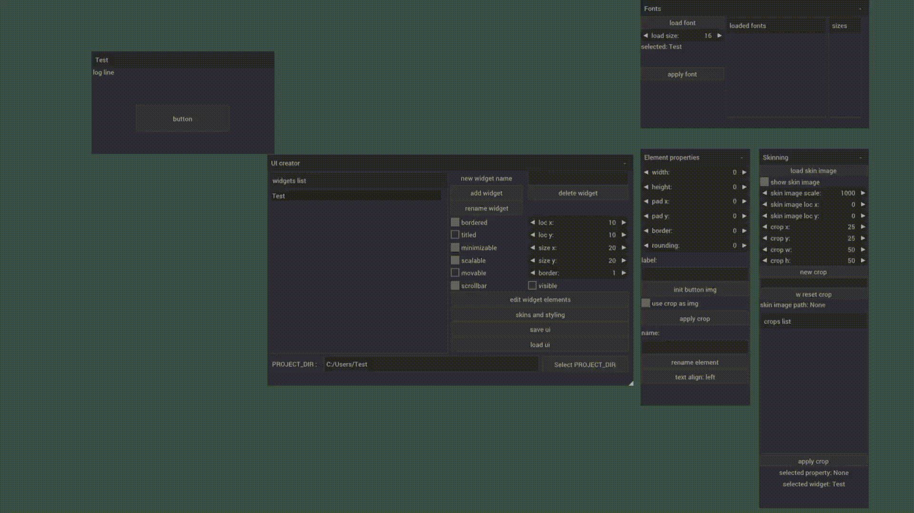
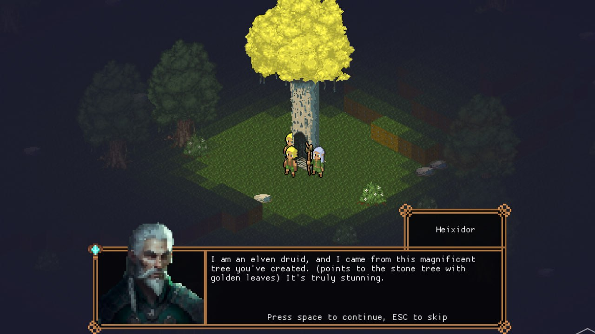
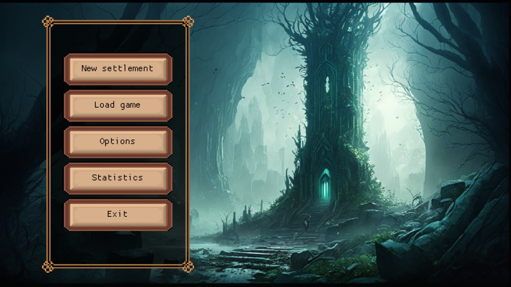
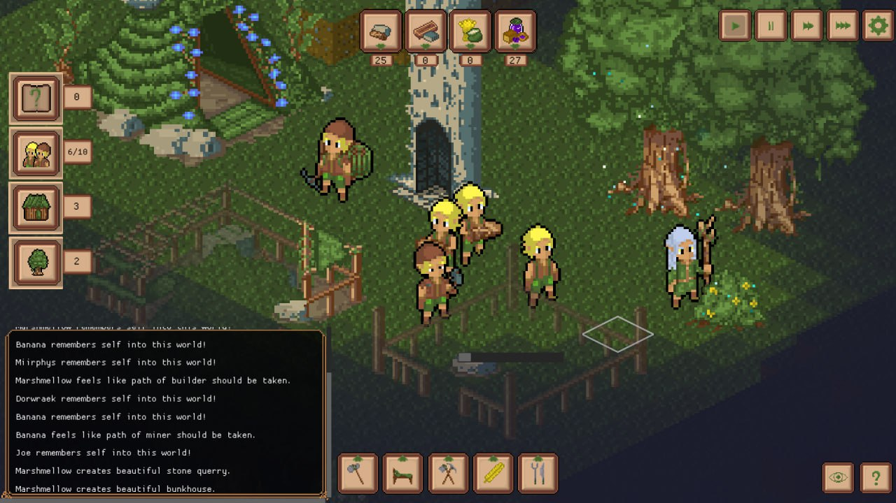

# UI creator

Quick embedding GUI into C++ application. Singletone UI object, for which element state can be accessed anywhere in the app.
<br>

## create UI
use [ui_editor](ui_editor) to quickly add some ui elements


## Customize styling


## integrate and use in application
see [example app](example_app).<br>

```C++
// include 
#include <IndieGoUI.h>

// declare UI manager
using namespace IndieGo::UI;
Manager GUI;

// get reference for UIMap
UI_elements_map & UIMap = GUI.UIMaps[winID];

// load created ui
GUI.deserialize("my window name", "path/to/ui.indg");

// check elements
if (UIMap["button"]._data.b) {
    // do stuff
    UIMap["log line"].label = "Stuff happens!";
}
```


<br>


## Building editor:
1. Make sure cmake available in PATH:

powershell:
```powershell
$env:Path="C:\Program Files\CMake\bin;$env:Path"
```

2. Build:

```powershell
cd example_app
cmake -Bbuild
cmake --build build
```

3. Run!

## Building example app:

1. Make sure cmake available in PATH:

powershell:
```powershell
$env:Path="C:\Program Files\CMake\bin;$env:Path"
```

2. Build:
```powershell
cd example_app
cmake -Bbuild
cmake --build build
```

3. Run:
```
.\env.ps1
build\Debug\GUI_example.exe
```

All resources (images and fonts) should be taken from location, pointed by  ```PROJECT_DIR``` env variable.<br>


```
$env:PROJECT_DIR="path\to\fonts\and\images"
```

```.\env.ps1``` will set this variable to ```<IndieGoUI dir>\example_app```

## Dependencies
All modules listed here are already integrated in this repo.
1. Google's [protobuf](https://developers.google.com/protocol-buffers) - save/load created ui
2. [GLFW](https://www.glfw.org/) - example app window, i/o handling
3. [Nuklear](backends/Nuklear/renderer.cpp) - currently implemented backend

## TODO:
1. Support Linux
2. Implement [ImGUI](https://github.com/ocornut/imgui) backend

# Example UI
  